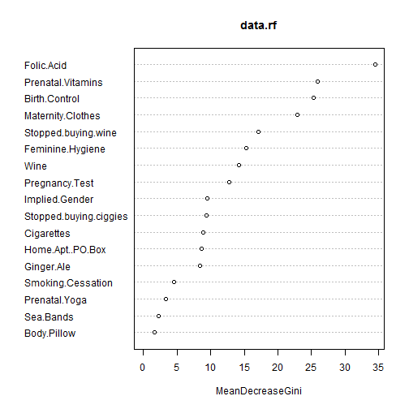

## Overview

Imagine you are the Marketing Executive for BigBox Retail Store. You would like to improve sales of maternity products. You would like to do that by targeting marketing efforts towards potential customers who are likely to purchase maternity products.

### Question:

Can we predict whether a specific customer has a pregnant household?

### Methodology:

Luckily, BigBox Retail Store has lot of historical customer data on customer purchases including household's pregnant status. This app will build a machine learning prediction model on the historical data using Random Forest and Genaralized Linear Model.

* You will tell the app this customer's shopping list and demographic information.
* App will predict whether the customer likely to have a pregant household.

--- .class #id 

## Project Motivation & Data

1. This application is based on codebook and data published by "Data Smart" book written by John W. Foreman. (Chapters 6 & 10)
2. Data is available at http://www.wiley.com/go/datasmart
3. Download "Pregnancy.csv" and "Pregnancy_Test.csv" from the above website 

### Features

* Customer Implied.Gender (obtained by matching name against Census data)
* Customer address is home/apartment/P.O.Box
* Shopping list: Pregnancy test, Prenatal Vitamins, Ginger Ale, Birth Control ... etc.,
* Recent purchase history on Cigarettes and Wine; Bought them regularly and then recently stopped buying

---

## Feature Importance

The chart below shows variable importance from Random Forest Prediction model.

 

---

## Results & Conclusions

### Out of Sample accuracy:

* RF model > 0.80 and GLM model accuracy > 0.80

### Test cases

1. *Select*: Female, Home, Seabands; deselect all other inputs. *Result*: RF model = Not Pregnant, and GLM Model = Pregnant. This is one of many cases where the results diverge between two models.

2. *Select*: Male, Apartment, Maternity clothes; deselect all other inputs. *Result*: RF model = Pregnant, and GLM model = Pregnant. This is one many other cases where the results converge between two models.

### Conclusion

When both models are converging to give same result = Pregnant, it is more likely the customer has pregnant household and is a candidate for direct marketing.
